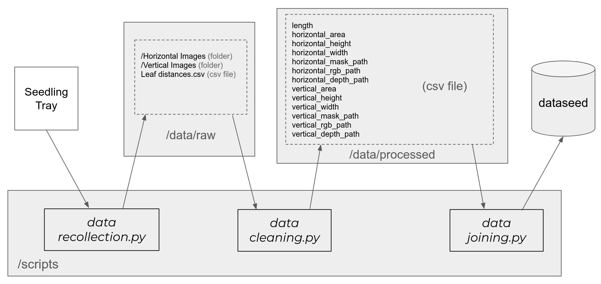

# dataseed

This repository contains a dataset with images (`rgb, depth, mask`) of artichoke seedlings, from two point of views (`horizontal, vertical`). 

A csv file with bounding box information from this two point of views (`horizontal heigth-width, vertical heigth-width`), and the value of the mask of the seedling in that two points of view. 

The aim of this dataset is to conform the information to perform detection and classification of artichoke seedlings in production enviroments.

## Pipeline

The following image shows the pipeline:

1. Apply `data_recollection.py` over a `seedling try` to obtain information and save it in `/data/raw/[date]`.
2. Apply `data_clearning.py` over a specific file of `/data/raw/[date]`.
3. Apply `data_joining.py` over a specific folder `/data/raw/[date]` to join new data into the `dataseed`.

### Use

### figures
`https://docs.google.com/presentation/d/173rA852JiZhZPG8QWpuMMOZkZgezP1hBd31omaqXm5A/edit#slide=id.p`

